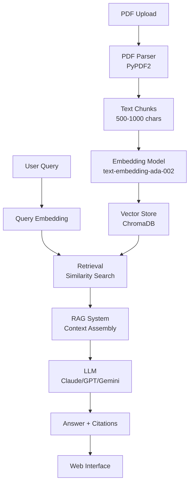

# Figure 1a: Web System Architecture Diagram - Creation Instructions

## Overview
This diagram shows the RAG-based web system architecture, focusing on the document processing, retrieval, and answer generation pipeline.

## Recommended Tools
1. **draw.io / diagrams.net** (Free, online) - https://app.diagrams.net/
2. **Lucidchart** (Professional)
3. **Miro** (Collaborative)
4. **Visio** (Microsoft)

## Step-by-Step Instructions for draw.io

### 1. Open draw.io
- Go to https://app.diagrams.net/
- Choose "Create New Diagram"
- Select "Blank Diagram"

### 2. Create Components (from top to bottom, left to right)

**Left Column (Document Processing):**
- **PDF Upload** (Top, light green box)
  - Text: "PDF Upload"
  - Position: Top left
  
- **PDF Parser** (Below PDF Upload, light blue box)
  - Text: "PDF Parser\n(PyPDF2)"
  - Position: Below PDF Upload
  
- **Text Chunks** (Below PDF Parser, light blue box)
  - Text: "Text Chunks\n(500-1000 chars)"
  - Position: Below PDF Parser

**Middle Column (Embedding & Storage):**
- **Embedding Model** (Same level as Text Chunks, light yellow box)
  - Text: "Embedding Model\n(text-embedding-ada-002)"
  - Position: Right of Text Chunks
  
- **Vector Store** (Right of Embedding Model, light yellow box)
  - Text: "Vector Store\n(ChromaDB)"
  - Position: Right of Embedding Model

**Right Column (Query Processing):**
- **User Query** (Top, light green box)
  - Text: "User Query"
  - Position: Top right, same level as PDF Upload
  
- **Query Embedding** (Below User Query, light blue box)
  - Text: "Query Embedding"
  - Position: Below User Query
  
- **Retrieval** (Same level as Query Embedding, light blue box)
  - Text: "Retrieval\n(Similarity Search)"
  - Position: Left of Query Embedding, connects to Vector Store

**Bottom Row (Generation & Output):**
- **RAG System** (Left, light red/pink box)
  - Text: "RAG System\n(Context Assembly)"
  - Position: Below Text Chunks
  
- **LLM** (Middle, light red/pink box)
  - Text: "LLM\n(Claude/GPT/Gemini)"
  - Position: Right of RAG System
  
- **Answer + Citations** (Left of Web Interface, light purple box)
  - Text: "Answer + Citations"
  - Position: Below RAG System
  
- **Web Interface** (Rightmost, light purple box)
  - Text: "Web Interface"
  - Position: Bottom right

### 3. Add Arrows (Data Flow)

1. PDF Upload → PDF Parser (down arrow)
2. PDF Parser → Text Chunks (down arrow)
3. Text Chunks → Embedding Model (right arrow)
4. Embedding Model → Vector Store (right arrow)
5. User Query → Query Embedding (down arrow)
6. Query Embedding → Retrieval (left arrow)
7. Vector Store → Retrieval (up-left arrow, bidirectional)
8. Retrieval → RAG System (down-left arrow)
9. RAG System → LLM (right arrow)
10. LLM → Answer + Citations (left arrow)
11. Answer + Citations → Web Interface (right arrow)

### 4. Color Coding

- **Light Green**: User Input (PDF Upload, User Query)
- **Light Blue**: Processing Components (PDF Parser, Text Chunks, Query Embedding, Retrieval)
- **Light Yellow**: Storage (Embedding Model, Vector Store)
- **Light Red/Pink**: Generation (RAG System, LLM)
- **Light Purple**: Output (Answer + Citations, Web Interface)

### 5. Styling

- Use rounded rectangles for all components
- Arrow style: Simple arrow with 2px line width
- Font: Arial or similar, 11-12pt, bold for component names
- Add component descriptions in smaller font below names

### 6. Export

- Export as PNG (high resolution, 300 DPI)
- Save as: `figure_1a_web_system_architecture.png`
- Place in: `evaluation/figures/` directory

## Alternative: Use the Provided XML File

1. Open draw.io
2. File → Open from → Device
3. Select `figure_1a_web_system_architecture_drawio.xml`
4. Edit as needed
5. Export as PNG

## Mermaid Code (for Markdown/HTML rendering)

If you're using Markdown or HTML, you can use this Mermaid code:

