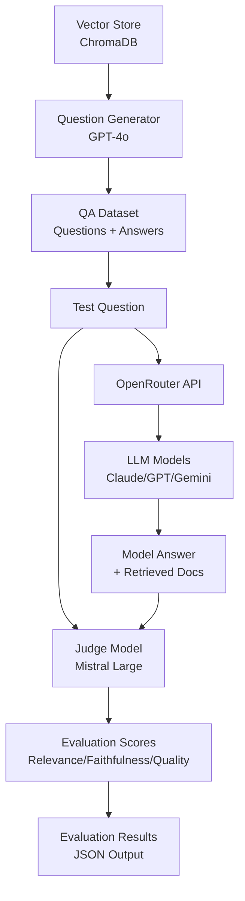

# Figure 1b: Evaluation System Architecture Diagram - Creation Instructions

## Overview
This diagram shows the LLM-as-a-Judge evaluation system architecture, focusing on the QA dataset generation, model testing, and evaluation pipeline.

## Recommended Tools
1. **draw.io / diagrams.net** (Free, online) - https://app.diagrams.net/
2. **Lucidchart** (Professional)
3. **Miro** (Collaborative)
4. **Visio** (Microsoft)

## Step-by-Step Instructions for draw.io

### 1. Open draw.io
- Go to https://app.diagrams.net/
- Choose "Create New Diagram"
- Select "Blank Diagram"

### 2. Create Components (from top to bottom, left to right)

**Left Column (Dataset Generation):**
- **Vector Store** (Bottom, light yellow box)
  - Text: "Vector Store\n(ChromaDB)"
  - Position: Bottom left
  
- **Question Generator** (Above Vector Store, light blue box)
  - Text: "Question Generator\n(GPT-4o)"
  - Position: Above Vector Store
  
- **QA Dataset** (Top, light green box)
  - Text: "QA Dataset\n(Questions + Answers)"
  - Position: Top left

**Middle Column (Model Testing):**
- **Test Question** (Top, light green box)
  - Text: "Test Question"
  - Position: Top middle
  
- **OpenRouter API** (Middle, light blue box)
  - Text: "OpenRouter API"
  - Position: Middle
  
- **LLM Models** (Below OpenRouter, light red/pink box)
  - Text: "LLM Models\n(Claude/GPT/Gemini)"
  - Position: Below OpenRouter
  
- **Model Answer** (Bottom, light purple box)
  - Text: "Model Answer\n+ Retrieved Docs"
  - Position: Bottom middle

**Right Column (Evaluation):**
- **Judge Model** (Middle, light red/pink box)
  - Text: "Judge Model\n(Mistral Large)"
  - Position: Middle right
  
- **Evaluation Scores** (Below Judge Model, light purple box)
  - Text: "Evaluation Scores\n(Relevance/Faithfulness/Quality)"
  - Position: Below Judge Model
  
- **Evaluation Results** (Bottom, light purple box)
  - Text: "Evaluation Results\n(JSON Output)"
  - Position: Bottom right

### 3. Add Arrows (Data Flow)

1. Vector Store → Question Generator (up arrow)
2. Question Generator → QA Dataset (up arrow)
3. QA Dataset → Test Question (right arrow)
4. Test Question → OpenRouter API (down arrow)
5. OpenRouter API → LLM Models (down arrow)
6. LLM Models → Model Answer (down arrow)
7. Model Answer → Judge Model (right arrow)
8. Test Question → Judge Model (diagonal arrow, for context)
9. Judge Model → Evaluation Scores (down arrow)
10. Evaluation Scores → Evaluation Results (down arrow)

### 4. Color Coding

- **Light Green**: Input/Data (QA Dataset, Test Question)
- **Light Blue**: Processing Components (Question Generator, OpenRouter API)
- **Light Yellow**: Storage (Vector Store)
- **Light Red/Pink**: Generation/Evaluation (LLM Models, Judge Model)
- **Light Purple**: Output (Model Answer, Evaluation Scores, Evaluation Results)

### 5. Styling

- Use rounded rectangles for all components
- Arrow style: Simple arrow with 2px line width
- Font: Arial or similar, 11-12pt, bold for component names
- Add component descriptions in smaller font below names

### 6. Export

- Export as PNG (high resolution, 300 DPI)
- Save as: `figure_1b_evaluation_system_architecture.png`
- Place in: `evaluation/figures/` directory

## Alternative: Use the Provided XML File

1. Open draw.io
2. File → Open from → Device
3. Select `figure_1b_evaluation_system_architecture_drawio.xml`
4. Edit as needed
5. Export as PNG

## Mermaid Code (for Markdown/HTML rendering)

If you're using Markdown or HTML, you can use this Mermaid code:

