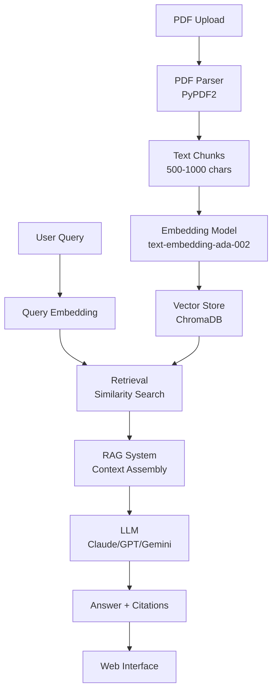
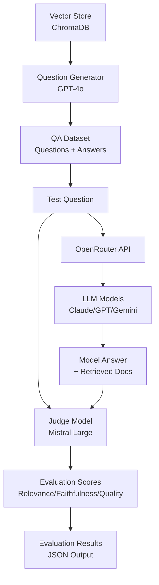

# Figure Descriptions and Creation Instructions

## Figure 1a: Web System Architecture Diagram

This diagram shows the RAG-based web system architecture, focusing on document processing, retrieval, and answer generation.

### Option 1: Mermaid Code (for Markdown/HTML)

## Figure 1b: Evaluation System Architecture Diagram

This diagram shows the LLM-as-a-Judge evaluation system architecture, focusing on QA dataset generation, model testing, and evaluation pipeline.

### Option 1: Mermaid Code (for Markdown/HTML)

### Option 2: Draw.io / Diagrams.net Instructions

See `FIGURE_1A_WEB_SYSTEM_INSTRUCTIONS.md` for detailed step-by-step instructions for creating Figure 1a.

### Option 3: Detailed Text Description

**Figure 1a: Web System Architecture**

The web system architecture follows a pipeline structure:

**Input Layer:**
- Users upload PDF files through a web interface
- Users submit queries through the same interface

**Processing Layer:**
- PDF files are parsed to extract text while preserving page information
- Text is chunked into semantically meaningful segments (500-1000 characters)
- Each chunk is embedded using OpenAI's text-embedding-ada-002 model
- Embeddings are stored in ChromaDB vector database with metadata (filename, page number)

**Query Processing:**
- User queries are embedded using the same embedding model
- Similarity search is performed in the vector database to retrieve top-k relevant chunks
- Retrieved chunks are passed to the RAG system

**Generation Layer:**
- RAG system combines retrieved chunks into context
- Context is passed to LLM along with the user query
- LLM generates answer based on context
- System extracts citations from retrieved chunks

**Output Layer:**
- Generated answers with citations are displayed to users through the web interface

**Figure 1b: Evaluation System Architecture**

The evaluation system architecture follows this workflow:

**Dataset Generation:**
- Vector store provides content for question generation
- Question Generator (GPT-4o) creates questions and reference answers
- QA Dataset is created with questions, answers, and context

**Model Testing:**
- Test questions are extracted from the QA dataset
- Questions are sent to OpenRouter API
- Multiple LLM models (Claude, GPT, Gemini) are tested via OpenRouter
- Each model generates answers with retrieved documents

**Evaluation:**
- Judge Model (Mistral Large) evaluates each answer
- Evaluation scores are generated on three dimensions: Retrieval Relevance, Faithfulness, and Answer Quality
- Results are compiled into JSON format for analysis

---

## Figure 2-5: Data Visualization Charts

These can be generated using Python (matplotlib) or Excel/Google Sheets.

### Figure 2: Retrieval Relevance Scores
- Type: Bar Chart
- X-axis: Models (Claude 3.5 Sonnet, GPT-3.5 Turbo, Gemini 2.5 Flash)
- Y-axis: Score (0-5)
- Values: 3.82, 3.68, 3.94

### Figure 3: Faithfulness Scores
- Type: Bar Chart
- X-axis: Models
- Y-axis: Score (0-5)
- Values: 3.96, 3.58, 4.20
- Use different colors for each bar

### Figure 4: Answer Quality Scores
- Type: Bar Chart
- X-axis: Models
- Y-axis: Score (0-5)
- Values: 4.12, 3.70, 4.32

### Figure 5: Average Response Time
- Type: Bar Chart
- X-axis: Models
- Y-axis: Time in seconds (0-12)
- Values: 10.84, 3.64, 2.17
- Note: Consider logarithmic scale due to large difference

